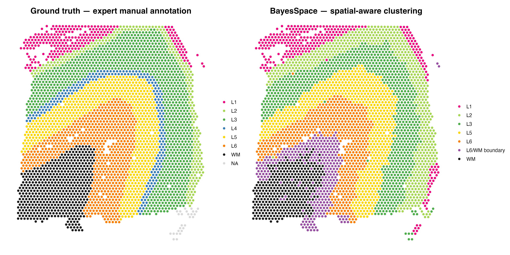
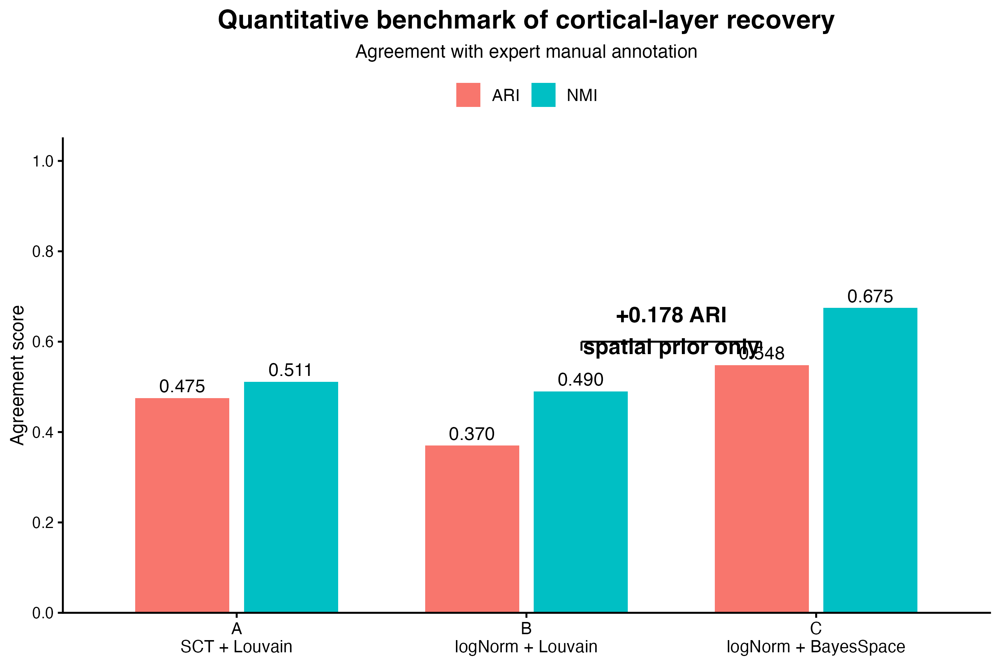
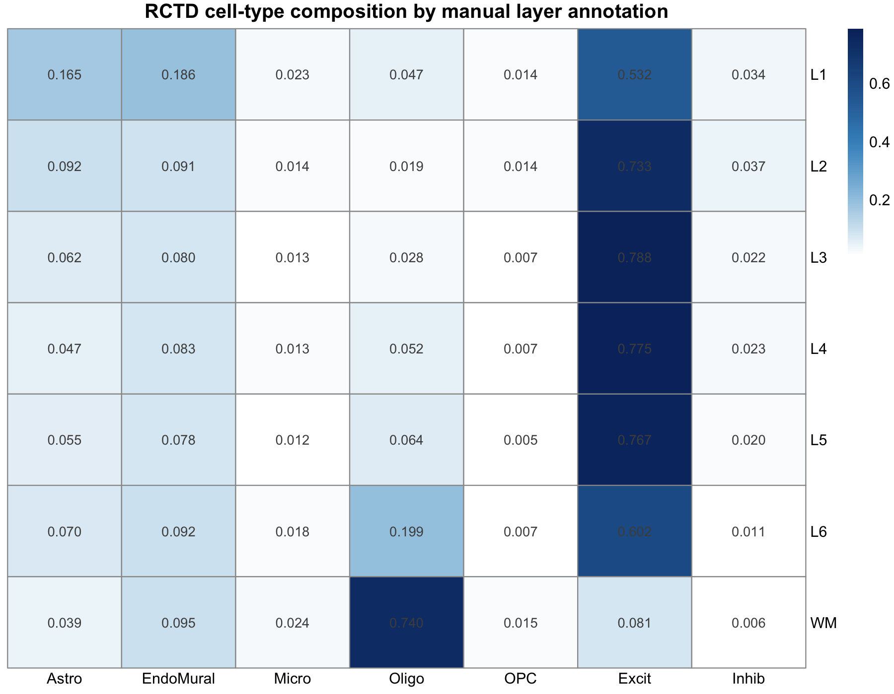

# Cortical Layer Recovery in Human DLPFC: Expression-Only vs. Spatially-Aware Clustering

Benchmarking three unsupervised clustering strategies against expert manual annotation on a
10x Visium section of human dorsolateral prefrontal cortex, then using snRNA-seq deconvolution
to explain *why* each strategy succeeds or fails.

**Data:** LIBD Human DLPFC Visium, section 151673 ([Maynard et al., 2021, *Nat Neurosci*](https://doi.org/10.1038/s41593-020-00787-0)),
accessed via `spatialLIBD`. **Evaluation set:** 3,553 spots with expert layer labels.

---

## Headline result



| Arm | Normalization | Method | Parameter | Clusters | ARI | NMI |
|:---:|---|---|---|:---:|---:|---:|
| **A** | SCTransform | Louvain | res 0.47 | 6 | 0.4755 | 0.5110 |
| **B** | logNormalize | Louvain | res 0.60 | 7 | 0.3699 | 0.4897 |
| **C** | logNormalize | **BayesSpace** | q = 7 | 7 | **0.5483** | **0.6746** |

<sub>Source: `results/tables/06_arm_summary.csv`</sub>

The three arms are designed so that **B vs. C isolates the spatial prior** — same normalization,
same input, same cluster count, differing only in whether the model uses spot coordinates.
That contrast is worth **+0.178 ARI** and **+0.185 NMI**.

The A vs. C gap (+0.073 ARI) is *not* a clean comparison: it confounds the spatial prior with
both the normalization and the cluster count (6 vs. 7). It is reported for completeness only.



---

## Three findings

### 1. The spatial prior separates L2 from L3 — but buys it with white-matter precision

Per-layer recall, expression-only (Arm A) vs. BayesSpace (Arm C):

| Layer | n | Arm A recall | Arm C recall | Change |
|---|---:|---:|---:|---|
| L1 | 243 | 0.881 | 0.984 | ▲ |
| L2 | 252 | 0.671 *(merged with L3)* | 0.821 *(resolved)* | ▲▲ |
| L3 | 988 | 0.848 *(merged with L2)* | 0.614 *(resolved)* | ▼ |
| L4 | 218 | 0.000 | 0.000 | — |
| L5 | 670 | 0.515 | 0.822 | ▲▲ |
| L6 | 671 | 0.572 | 0.686 | ▲ |
| WM | 511 | **1.000** | 0.722 | ▼▼ |

<sub>Source: `results/tables/05_per_layer_recall.csv`, `results/tables/06_per_layer_recall_armC.csv`</sub>

Arm A collapses L2 and L3 into a single cluster; BayesSpace splits them. But WM, which Arm A
recovered *perfectly* (511/511), is split by BayesSpace across a WM domain (369 spots) and a
transition domain (142 spots). Finding 3 argues this is the annotation being wrong, not the model.

### 2. L4 is not recoverable — and deconvolution says why

L4 has zero recall in **every** arm. In Arm A its 218 spots scatter (112 → L2/L3, 51 → L5,
30 → L6, 25 → Non-laminar); in Arm C the spatial prior tidies them into two blocks
(150 → L3 domain, 68 → L5 domain) but still never isolates them.

RCTD deconvolution against LIBD's own DLPFC snRNA-seq reference explains this at the
composition level — **L4 has no distinct cell-type profile**:

| Cell type | L3 | **L4** | L5 | min. gap to a neighbour |
|---|---:|---:|---:|---:|
| Excit | 0.788 | **0.775** | 0.767 | 0.0083 |
| EndoMural | 0.080 | **0.083** | 0.078 | 0.0028 |
| Astro | 0.062 | **0.047** | 0.055 | 0.0080 |
| Oligo | 0.029 | **0.052** | 0.064 | 0.0118 |
| Inhib | 0.022 | **0.023** | 0.020 | 0.0014 |
| Micro | 0.013 | **0.014** | 0.012 | 0.0006 |
| OPC | 0.007 | **0.007** | 0.005 | 0.0002 |

<sub>Source: `results/tables/07_L4_celltype_composition.csv`</sub>

The largest separation of L4 from either neighbour is 0.0118 (Oligo), and that is just the
L3→WM myelination gradient passing through — not an L4 feature. At the level of seven broad
cell types L4 is genuinely intermediate; its identity lives in layer-specific genes (*RORB* and
similar) **within** the excitatory class, which this reference collapses.

**A spatial prior fixes boundaries. It cannot manufacture a distinction that expression space
does not contain.**



### 3. The L6/WM "error" is a real anatomical transition zone

BayesSpace produced one domain with no clean layer identity (175 L6 spots + 142 WM spots).
Pre-registered test: if it is a genuine transition, its cell-type composition should sit
*between* L6 and WM on both markers.

| Domain | n | Oligo | Excit |
|---|---:|---:|---:|
| L6 | 560 | 0.109 | 0.709 |
| **L6/WM boundary** | **319** | **0.480** | **0.283** |
| WM | 374 | 0.815 | 0.029 |

<sub>Source: `results/tables/07_bayesspace_domain_composition.csv`</sub>

It passes on both. Oligo (0.480) lands almost exactly at the L6–WM midpoint (0.462); Excit
leans toward the WM end. Independent support: the `prop_Oligo` spatial map shows a gradient
ring around the WM patch, not a hard edge.

So the drop in WM recall from 1.000 to 0.722 is BayesSpace resolving a structure the manual
annotation forces into a binary line — **a scoring penalty for being biologically right.**

---

## What did *not* work, reported as such

**The 388 "Non-laminar" spots remain unexplained.** Arm A produced a cluster whose markers are
fibroblast/meningeal (*COL1A1*, *COL1A2*, *MGP*), plasma-cell (*IGKC*, *IGLC2*, *IGHA1*) and
secretory-epithelial (*SCGB2A2*, *TFF1/3*, *MUC1*), with no neural or glial markers. Deconvolution
was expected to identify them. It did not: no cell type is meaningfully enriched (ratios
Oligo 1.31, Micro 1.21, EndoMural 1.19 … Excit 0.94 — see `07_nonlaminar_celltype_comparison_ctxonly.csv`).
Neither the vascular nor the meningeal reading is supported.

The likely reason is a **structural limitation of the reference**: none of those marker
identities exist among its seven broad classes, so RCTD cannot report them and must redistribute
the signal. The arithmetic fits — Excit falls 0.0422 in these spots and the six other types'
gains sum to exactly 0.0422, forced by the rows summing to 1, while the fraction of high-Excit
spots collapses (0.057 vs. 0.280). That is dilution by something unrepresented, not depletion.

The question is likely unanswerable with this reference. That limit is the honest finding.

---

## Methodological design

Three choices in this pipeline are there specifically to make the benchmark credible.

**Ground truth is quarantined, not merely unused.** Manual annotations ship inside `colData()` of
the `SpatialExperiment`. If they ride along into the Seurat object they are one `table()` call
away from contaminating every parameter choice downstream. Script 03 extracts them to a separate
file, strips every layer-related column, and asserts that nothing survives — they are not reopened
until script 05.

**The clustering resolution was fixed before unsealing.** Louvain cannot produce exactly 7 clusters
at any resolution in [0.1, 1.0]; the scan oscillates (0.44 → 6, 0.45 → 5, 0.46–0.49 → 6) and jumps
0.49 → 6 to 0.50 → 8. Resolution 0.47 was chosen as the midpoint of the stable plateau, on cluster
count alone. The retrospective sensitivity scan later showed 0.47 is the **ARI maximum** of the grid
(`05_resolution_sensitivity.csv`). This is a favourable coincidence, not tuning, and is reported as such.

**The QC threshold was audited for bias.** The conventional mitochondrial filter (≥ 0.20) was dropped
in script 02 on truth-free evidence: the ratio distribution is unimodal with no damaged-spot
subpopulation. A retrospective check in script 05 — placed there, not in 02, because it consumes
ground truth — shows the filter would have been strongly layer-biased: it flags 40.1% of L3 and
36.6% of L1 spots but only 0.6% of WM, a 66-fold range. The gradient tracks cell-type composition
(neurons are mitochondria-rich; WM is 74% oligodendrocyte by RCTD), not tissue damage. Applying it
would have silently deleted a third of the upper cortex.

Two further conventions: **every output file's numeric prefix is the script that generates it**,
and **every number in this README traces to a file in `results/tables/`.**

---

## Pipeline

| Script | Does | Key outputs |
|---|---|---|
| `00_setup.R` | Package installation, version capture | `package_versions.csv` |
| `01_download_spatial_data.R` | Fetch Visium data, subset section 151673 | `spe151673_raw.rds` |
| `02_spatial_qc.R` | QC; drops mito criterion on distributional evidence | `02_mito_ratio_distribution.png` |
| `03_seurat_preprocessing.R` | **Quarantine ground truth**; SCTransform → PCA → resolution scan → Louvain | `03_resolution_scan.csv` |
| `04_cluster_markers.R` | Marker detection (9,067 rows), layer-signature scoring, marker-informed annotation, spatial maps | `04_all_markers.csv`, `04_signature_annotation_summary.csv` |
| `05_baseline_benchmark.R` | **Unseal.** ARI/NMI, confusion matrix, per-layer recall, sensitivity, retrospective QC audit | `05_baseline_metrics.csv` |
| `06_spatial_clustering_benchmark.R` | Three-arm benchmark; BayesSpace q = 7 | `06_arm_summary.csv` |
| `07_rctd_celltype.R` | RCTD deconvolution; answers the three questions above | `07_prop_by_true_layer.csv` |
| `08_final_figures.R` | Presentation figures | `08_truth_vs_bayesspace.png` |

Automatic layer calls came from signature scores, but were **overridden by marker identity** where
the two disagreed. Cluster 4 scored highest for L4 — with the lowest margin of any cluster
(0.305) — yet carries no laminar marker at all, so it was labelled Non-laminar rather than L4
(`04_signature_annotation_summary.csv`).

---

## Reproducing

```bash
git clone https://github.com/xih0320/DLPFC_scRNA_spatial_project.git
cd DLPFC_scRNA_spatial_project
```

Then, from the project root in R (the scripts assume it as the working directory):

```r
source("scripts/00_setup.R")   # installs CRAN / Bioconductor / GitHub dependencies
source("scripts/01_download_spatial_data.R")
# ... through 08, in order
```

Data are downloaded programmatically and are **not** committed (`data/` is gitignored; the
processed objects total ~180 MB). Every script ends with a file-size assertion over its own
outputs, and writes a `NN_sessionInfo.txt`. Run under R 4.4.2, Seurat 5.5.1, spatialLIBD 1.18.0,
BayesSpace 1.16.0, spacexr 2.2.1.

Runtime notes: script 06 takes roughly 10 minutes (50,000 MCMC iterations); script 07 downloads a
~172 MB snRNA-seq reference and runs RCTD.

---

## Limitations

- **Single section (n = 1).** All numbers describe section 151673 only. Cross-section
  variability is not assessed.
- **Reference downsampled to ≤ 2,000 cells per type** (~13,540 of 56,447) to fit memory when
  building the RCTD reference. A deliberate compute trade-off; per-type profiles are stable well
  below this.
- **Seven broad cell types only.** As Finding 2 and the negative Q1 result both show, this
  granularity is the binding constraint on what deconvolution can explain.
- **Four edge spots have no Visium neighbours**, so the spatial prior cannot act on them.
- Marker genes are sparsely detected outside *MBP*, consistent with Visium dropout; `vis_gene`
  plots only spots with non-zero expression, so blanks mean "not detected", not "low".

---

## References

Maynard KR, Collado-Torres L, Weber LM, et al. Transcriptome-scale spatial gene expression in the
human dorsolateral prefrontal cortex. *Nat Neurosci* 24, 425–436 (2021).

Zhao E, Stone MR, Ren X, et al. Spatial transcriptomics at subspot resolution with BayesSpace.
*Nat Biotechnol* 39, 1375–1384 (2021).

Cable DM, Murray E, Zou LS, et al. Robust decomposition of cell type mixtures in spatial
transcriptomics. *Nat Biotechnol* 40, 517–526 (2022).
